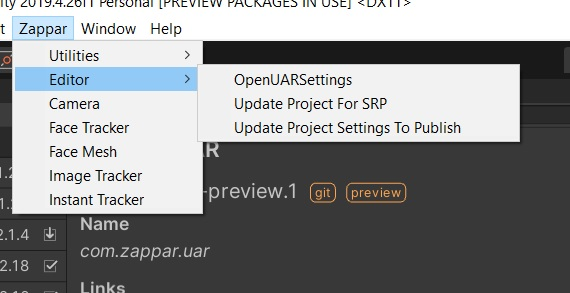
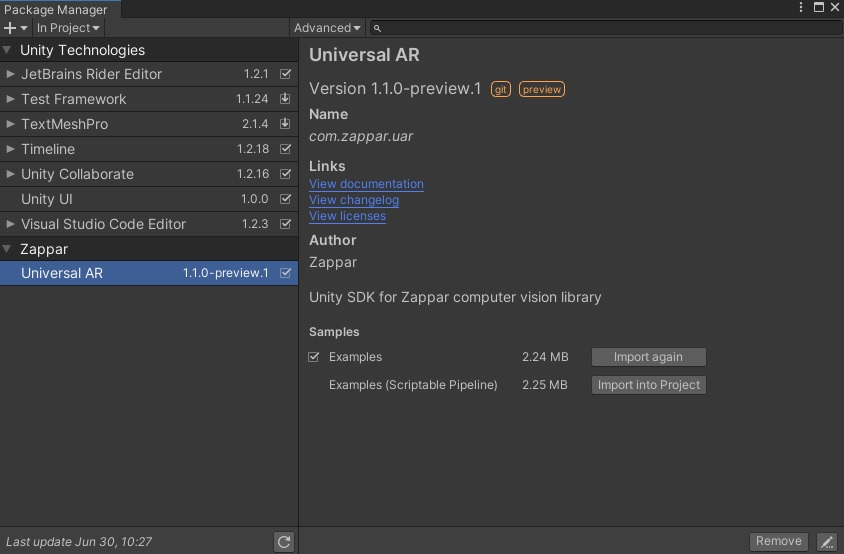
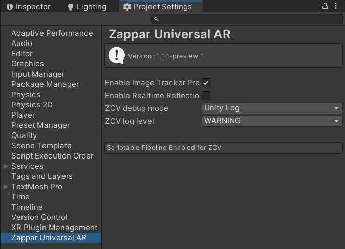
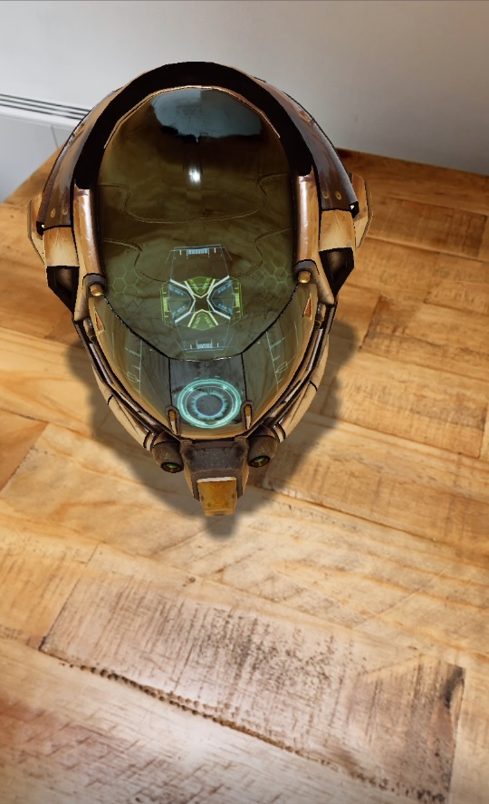

# universal-ar-unity

This project is a Unity package wrapping all ZCV internals and features like - image tracking, face tracking, face mesh, and instant tracking. More details about the features and pipeline can be read here: https://docs.zap.works/universal-ar/unity/

## Importing package into Unity

You can import the package directly from the editor by following these steps:
1. Opening the `Package Manager` from `Window>Package Manager` from Editor
2. Locate the `+` button on top left corner and select `Add package from git URL...`
3. Enter the following URL: `https://github.com/zappar-xr/universal-ar-unity.git`

This will automatically fetch the latest version of the package from Github.

Another option is to define the `universal-ar-unity` package as dependency in your projects' `manifest.json` file located under `Root_Directory>Packages`.

```
{
  "dependencies": {
    "com.zappar.uar": "https://github.com/zappar-xr/universal-ar-unity.git"
  }
}
```

Note that you can modify the source github URL to define any particular `tag` or `branch` as well, by adding suffix: `#ID` to the git URL. You can read more about it here: https://docs.unity3d.com/Manual/upm-git.html

## Supporting Unity Scriptable Render Pipeline (SRP)

In order to use the UAR SDK with Unity SRP, you'll need to update the zappar editor settings. This setting can be accessed from Zappar menu `Editor/Update Project For SRP`.



This adds an additional scripting symbol `ZAPPAR_SRP` to the Unity project, which updates the internal zappar pipeline to support SRP rendering events. Please note if you were previously using `Standard Pipeline` you can update the existing scenefrom menu `Editor/Update Zappar Scene For SRP` as well. This option updates the camera settings.

If you have any missing material/shader in scene or while adding new zappar asset i.e. `Zappar/Face Tracker`, etc. you can find the appropriate material reference from examples scene. Please check below on how to add sample scenes from the package. Please note that along with updating the material in MeshRenderer component you will also need to update the material reference in Zappar script attached on the same object as well.

## Importing Examples

Once the package has been successfully added, you should see additional option in the package window to add sample examples. You should select either one of the two samples available, depending upon whether or not you are using Unity SRP.



Import them to add example scenes to your main project and start zapping in no time!

## Zappar Universal AR Settings

You can access additional project level settings of UAR from `Zappar/Editor/OpenUARSettings`.



The settings currently include options to enable/disable image preview for image tracking and some debugging options.


## Extras: Enabling Realtime Reflection



To enable the realtime reflection for your reflective materials, follow the following process:
1. Make sure realtime reflection is enabled from Unity project settings. `Edit/ProjectSettings/Quality` and check `Realtime Reflection Probes`.
2. Enable `Enable Realtime Refections` from menu `Zappar/Editor/OpenUARSettings`. This will add a new layer `ZapparReflect` to your project.
3. Right click on `ZapparCameraRear` (Camera object containing `ZapparCamera` script) and select `Zappar/AddRealtimeReflectionProbe`.
4. Adjust the `ZapparReflectionProbe` properties according to your project needs.


## Links and Resources
* [Web site](https://zap.works/universal-ar/)
* [Documentation](https://docs.zap.works/universal-ar/unity/)
* [Forum](https://forum.zap.works/)
* [Issue tracker](https://github.com/zappar-xr/universal-ar-unity/issues)
* [Source code](https://github.com/zappar-xr/universal-ar-unity)


